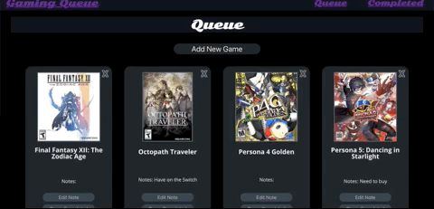
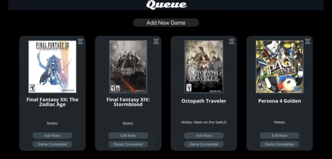
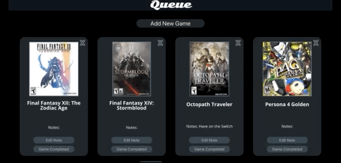

# Gaming Queue

Created by Laura Jinks Jimenez

## Technologies Used:
Javascript | React | Node.js | PostgreSQL

##Purpose
To familiarize myself with React, Node, SQL, and external APIs

##Features

* Games stored in the database are loaded into the gaming queue in alphabetical order. The user can add or edit the notes section.

 

 

* The user can search for games via the GiantBomb API, and add a game to the database. Once a game is added, the user is returned to the home page with the new game added into the list.

 

 

* Once a game has been completed, the user can click the "Completed" button to move the game to the Completed page. On the completed page, the viewer can review all previously completed games, add/edit notes, or return the game to the queue if they wish to play the game again.

 

 

* If the user clicks on the game image, a brief description of the game shows up, along with a link to the full GiantBomb page of the game.

 

 

* The user can completely remove the game from the database from either the Queue or Completed list.

 

